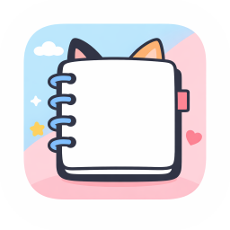

# KittenNote - 跨平台PWA笔记软件

一款自由的的渐进式Web应用(PWA)笔记软件，支持跨设备同步、文字与墨迹混合编辑、多主题定制和AI辅助编写。



## 🌟 主要特性

### 📝 笔记编辑

- **双模式编辑**：支持文字编辑和墨迹绘制（单页单模式）
- **文字编辑器**
  - 基础富文本功能：加粗、斜体、下划线
  - 内部存储为Markdown格式
  - NES（Next Edit Suggestion）AI编写辅助功能
- **墨迹编辑编程**
  - 完整的压力感应笔触支持
  - 绘制工具：画笔、荧光笔、橡皮擦、各类几何图形
  - 撤销/重做功能
  - 实时笔迹预览和平滑渲染

### 📚 笔记组织

- **多层级目录结构**
  - 根目录下可创建无限层级的子目录
  - 每个目录包含多个笔记本，每个笔记本包含多页笔记
- **拖拽排序**：直观的拖拽操作重新排列目录、笔记本和笔记页
- **快速导航**：目录树视图展示整体结构，支持展开/折叠

### 💾 备份与恢复

- **完整备份**：一键导出整个数据库为ZIP格式
- **定时提醒**：可配置的备份间隔（1-30天，默认3天）
- **智能导入**
  - 支持ZIP备份包恢复
  - 支持单个笔记本ZIP包导入
  - 自动持久化笔记原有样式（背景色、底纹）

### 🎨 自定义主题与样式

- **深浅色主题**：自动跟随系统主题设置
- **调色板系统**
  - 多个预设配色方案
  - 自定义强调色
  - 一键应用推荐配色
- **笔记本页面样式**
  - 6种底纹选择：空白、横线、网格、点阵、四线三行、五线谱
  - 自定义背景色配置
  - 样式在导出/导入时自动保持

### 🔄 跨设备同步

- **本地网络同步**
  - 基于WebRTC的点对点直连
  - 无需中心信令服务器
- **端到端加密**
  - Ed25519密钥对生成与管理
  - AES-GCM数据加密
  - ECDH密钥协商
- **智能同步**
  - 操作转换(OT)算法解决编辑冲突
  - 版本向量维护
  - 最终一致性模型

### 📤 导出功能

- **多格式导出**
  - 文字笔记 → Markdown文件
  - 墨迹笔记 → KTNT格式（自定义JSON）
  - 笔记页 → PDF格式
  - 笔记页 → PNG图片（含背景样式）
  - 整个笔记本 → ZIP包（含元数据）
- **日志导出**：调试日志支持实时导出

### 🤖 AI辅助编写（NES）

- **推理管道**
  - 空闲自动触发推理
  - 专属Web Worker避免UI阻塞
  - 半透明浅色建议显示
- **交互方式**
  - Tab键快速插入
  - 屏幕右下角悬浮按钮
  - API模式和本地模式切换

### 📱 PWA特性

- **离线支持**
  - Service Worker缓存策略
  - 离线状态自动备份
  - 数据完全本地存储
- **独立应用**
  - 可作为独立应用安装
  - 全屏模式运行
  - 主屏快捷访问
- **跨平台**
  - Windows、macOS、Linux浏览器
  - iOS Safari
  - Android Chrome

## 🏗️ 项目架构

### 数据存储

```text
IndexedDB
├── folders              # 文件夹结构
├── notebooks            # 笔记本定义
├── notes                # 笔记页内容（墨迹为日志型对象）
├── devices              # 已连接设备信息
├── syncLog              # 同步操作历史
├── settings             # 用户偏好设置
└── modelChunks          # NES模型分片存储
```

### 核心模块

| 模块 | 功能 | 备注 |
| --- | --- | --- |
| `database.js` | IndexedDB增删改查、备份导入导出 | 全局数据管理 |
| `app.js` | 应用主控制、事件分发 | 启动和协调各模块 |
| `text-editor.js` | Markdown编辑和渲染 | 包含NES建议集成 |
| `ink-editor.js` | Canvas绘制、笔触处理 | 支持压力感应和各类绘制工具 |
| `directory-tree.js` | 目录树UI和操作 | 支持拖拽排序 |
| `settings.js` | 用户设置UI和存储 | 主题、备份、模型管理 |
| `sync.js` | 同步通信和设备管理 | 点对点加密连接 |
| `nes.js` | NES推理引擎 | WASM模型管理 |
| `export.js` | 各类导出格式处理 | ZIP编码、元数据管理 |
| `sw.js` | Service Worker缓存 | 离线支持 |

## 🚀 快速开始

### 系统要求

- 现代浏览器
- 支持IndexedDB、WebAssembly（可选）、WebRTC
- 4GB以上存储空间（用于模型文件）

### 部署方式

#### 1. 本地开发

```bash

python3 -m http.server 8000
# 或使用Node.js
npx http-server
# 访问 http://localhost:8000
```

#### 2. 生产部署

```bash
# 支持任何静态文件服务
# 推荐配置
- 启用HTTPS（Web Worker要求）
- 启用CORS（跨域请求）
- 设置正确的MIME类型（.wasm → application/wasm）
- 配置缓存策略（长期缓存核心资源）
```

### 首次使用

1. 访问应用URL
2. 允许Service Worker安装
3. 点击"添加到主屏幕"以获得最佳体验
4. 创建第一个笔记本并开始编写

## 📖 使用指南

### 笔记创建与编辑

```text
1. 左侧栏 → 右键创建新笔记本
2. 选择编辑模式：文字或墨迹
3. 编辑完成后自动保存
4. 支持历史版本通过同步恢复
```

### 备份和恢复

```text
1. 打开设置 → 备份选项卡
2. 设置备份间隔（默认3天）
3. 点击"导出备份"创建ZIP文件
4. 恢复时点击"导入备份"选择ZIP文件

注意：恢复将完全覆盖本地数据，建议先导出当前备份
```

### 与其他设备同步

```text
1. 主设备：设置 → 同步选项卡 → 显示配对码
2. 扫描生成的二维码
3. 其他设备自动建立加密连接
4. 编辑内容自动在设备间同步
```

### 导出笔记

```text
文字笔记：
  - 单页 → Markdown（文字编辑器菜单）
  - 整本 → ZIP包含所有文件

墨迹笔记：
  - 单页 → PNG（保留背景样式）
  - 单页 → PDF
  - 单页 → KTNT（原生格式）

整个笔记本：
  - 右键笔记本 → 导出为ZIP
  - 包含notebook.json元数据和所有笔记
```

### AI编写助手（NES）

```text
1. 设置 → AI助手 → 启用NES
2. 选择运行模式：
   - API：连接远程推理服务
3. 在文字编辑中：
   - 停止输入后按照设定的延时自动触发建议
   - 按Tab插入建议
   - 或点击右下角浮动按钮
```

## 🛠️ 开发指南

### 项目结构

```text
kitten-note/
├── index.html              # 主应用页面
├── manifest.json           # PWA配置
├── sw.js                   # Service Worker
├── instruction             # 设计文档
├── LICENSE                 # GPL-3.0许可证
│
├── js/                     # 核心JavaScript模块
│   ├── app.js              # 应用主控制器
│   ├── database.js         # 数据库层
│   ├── text-editor.js      # 文字编辑器
│   ├── ink-editor.js       # 墨迹编辑器
│   ├── directory-tree.js   # 目录树
│   ├── settings.js         # 设置管理
│   ├── sync.js             # 同步系统
│   ├── nes.js              # AI推理引擎
│   ├── export.js           # 导出处理
│   └── toast.js            # 通知组件
│
├── css/                    # 样式表
│   ├── styles.css          # 全局样式
│   ├── themes.css          # 主题定义
│   ├── editor.css          # 编辑器样式
│   └── ink-editor.css      # 墨迹编辑器样式
│
├── icons/                  # 应用图标
│   └── *-*.png             # 各尺寸PNG
│
└── assets/                 # 第三方资源
    ├── fontawesome/        # Font Awesome图标
    ├── llama-cpp-wasm/     # WASM推理框架
    └── nes-model/          # 預量化模型文件
```

### 开发工作流

```bash
# 修改代码后，浏览器自动重加载（Service Worker清理）
# 或手动清除缓存：
# 1. DevTools → Application → Clear site data
# 2. 重新加载页面

# 调试技巧：
# - 开启Debug Logger：app.logger.setOverlayEnabled(true)
# - 导出日志查看详细信息
# - IndexedDB Inspector查检数据状态
```

### 关键实现细节

#### 墨迹存储格式（KTNT）

```json
{
  "version": "1.0",
  "type": "ink",
  "pageStyle": {
    "pattern": "grid|lines|dots|blank|calligraphy|staff",
    "color": "#RRGGBB"
  },
  "strokes": [
    {
      "tool": "pen|highlighter|eraser|shape",
      "color": "#RRGGBB",
      "pressure": 1.0,
      "points": [{"x": 0, "y": 0, "t": 0}]
    }
  ]
}
```

#### ZIP备份格式

```text
backup-2026-02-06T10:30:00Z.zip
├── kittennote-backup.json    # 完整数据库导出
└── metadata.json              # 备份信息
```

#### 备份数据结构

```text
{
  "version": "1.0",
  "exportedAt": "2026-02-06T10:30:00Z",
  "folders": [],
  "notebooks": [],
  "notes": [],
  "devices": [],
  "syncLog": [],
  "settings": {},
  "modelChunks": []
}
```

## 🔒 安全性考虑

### 密钥管理

- **本地生成**：所有密钥对在本地生成，不上传服务器
- **存储加密**：私钥使用WebCrypto加密存储于IndexedDB
- **通道加密**：设备间通信使用AES-GCM加密

### 数据隐私

- **完全本地**：除同步外，所有数据仅存储于本地设备
- **可选同步**：用户完全控制是否启用设备同步
- **导出加密**：支持为导出文件添加密码保护

## 🐛 故障排除

### 常见问题

**Q: Service Worker无法注册**
A: 确保使用HTTPS（本地开发除外）和正确的MIME类型

**Q: 同步失败**
A: 检查防火墙设置，确保两设备在同一网络，查看Debug日志

**Q: NES建议不出现**
A: 1) 检查是否启用NES开关 2) 确认模型已下载 3) 查看浏览器控制台错误

**Q: 笔迹导出为PNG为白色背景**
A: 检查笔记本的pageStyle设置，确认图案和颜色已配置

## 📄 许可证

本项目采用 **GNU General Public License v3.0** 许可证。

Copyright (C) 2026 Author of KittenNote

详见 [LICENSE](LICENSE) 和 [GPL-3.0.txt](GPL-3.0.txt)

### 许可条款摘要

- ✅ 自由使用、修改和分发
- ✅ 任何衍生作品需采用相同许可
- ❌ 不提供任何担保
- ❌ 作者不承担任何责任

## 🤝 致谢

- **Font Awesome** - 图标库

## 📞 支持与联系

- **问题反馈**：提交GitHub Issue

## 📈 项目统计

| 指标 | 数值 |
| --- | --- |
| 代码行数 | 8000+ |
| 模块数 | 10+ |
| 支持浏览器 | 4+ |
| 本地化语言 | 中文 |
| 许可证年份 | 2026 |

---

**KittenNote** - 让记笔记变得更自由 🐱📚

更新于：2026年2月6日 | [返回顶部](#kittennote---跨平台pwa笔记软件)
