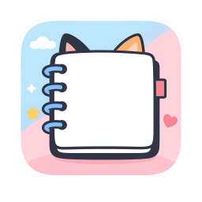

# KittenNote - 跨平台PWA笔记软件

一款自由的渐进式Web应用（PWA）笔记软件，支持跨设备同步、文字与墨迹混合编辑、多主题定制和AI辅助编写。



## 🌟 主要特性

### 📝 笔记编辑

- **双模式编辑**：同一个笔记本里可以同时创建文字笔记和墨迹笔记（单页单模式）
- **文字编辑器**
  - 基础富文本功能：加粗、斜体、下划线、标题、列表、引用
  - 内部以 Markdown 格式存储，可随时切换到 Markdown 源代码模式直接编辑
  - 字号缩放、光标位置记忆、输入后自动保存
  - NES（Next Edit Suggestion）AI 编写建议：停止输入后自动触发，按 Tab 接受
- **墨迹编辑器**
  - 完整的压力感应笔触支持，可开关压感变宽，支持平滑处理与自动矫直
  - 绘制工具：移动、画笔、荧光笔、橡皮擦、套索选择、直线、矩形、圆形、箭头、插入图片
  - 笔画颜色/粗细调节与快捷色板，撤销/重做
  - 画布缩放、视图复位、双向滚动条、清空画布

### 📚 笔记组织

- **多层级目录结构**：文件夹 → 笔记本 → 笔记页，层级不限
- **拖拽排序**：直接拖动文件夹、笔记本和笔记重新排列
- **快速搜索**：侧边栏搜索框实时过滤目录树
- **右键菜单**：重命名、删除、新建文字/墨迹笔记、笔记本设置、AI 自动标题、导出

### 💾 数据与备份

- **双存储引擎**（设置 → 存储）
  - IndexedDB（默认）：文件夹、笔记本、笔记、设置、同步信息、图片等核心数据
  - OPFS 块存储（可选）：笔记正文按 1 MB 分块写入，逐块 SHA-256 比对，只重写发生变化的块，减少 SSD 磨损
  - 两种引擎之间可一键迁移，支持迁移断点记录与中断后的自动修复
- **备份与恢复**
  - 一键导出 ZIP 备份（`kittennote-backup.json`；OPFS 模式下附带 `opfs-mirror/` 块文件）
  - 备份提醒间隔可配置（1–30 天，默认 3 天）
  - 导入前自动快照、备份版本校验，并提供数据恢复入口；误删 IndexedDB 时可尝试从 OPFS 零散块文件重建笔记
- **存储可靠性**：启动时申请持久化存储（`navigator.storage.persist`），OPFS 多标签页写入通过 Web Locks 协调
- **OPFS 健康工具**：完整性验证、碎片整理、占用统计与笔记文件明细

### 🎨 自定义主题与样式

- **深浅色主题**：自动跟随系统 / 浅色 / 深色
- **调色板系统**：30+ 强调色与 30+ 预设主题，可一键应用推荐配色
- **笔记本页面样式**
  - 6 种底纹：空白、横线、方格、点阵、四线三行、五线谱
  - 自定义背景色
  - 样式在导出/导入时自动保留
- **调试日志悬浮窗**：适合移动端，可实时查看并导出日志

### 🔄 跨设备同步

- **WebRTC P2P**：局域网内点对点直连，通过二维码或文本交换配对信息，无需中心信令服务器
- **应用层端到端加密**：ECDH P-256 握手 + AES-256-GCM 逐条消息加密（详见[安全性](#-安全性)）
- **差量同步**：比较双方数据清单指纹，只传输缺失或更新的内容
- **删除传播与冲突合并**：删除操作以 tombstone 传播到其他设备；并发修改按 Last-Write-Wins（LWW）合并
- **同步向导**：支持摄像头扫码与手动粘贴两种方式，实时显示同步进度

### 📤 导入与导出

- **导入**
  - `.md`、`.ktnt`、`.json`（自动识别 KTNT 格式）导入到指定笔记本
  - `.zip` 笔记本包导入（支持整个笔记本恢复）
- **导出**
  - 文字笔记 → Markdown 文件
  - 墨迹笔记 → KTNT 原生格式（版本 2，含内联图片）
  - 任意笔记 → PDF（通过浏览器打印对话框）
  - 墨迹笔记 → PNG 图片（含背景样式）
  - 整个笔记本 / 文件夹 → ZIP 包（含 `notebook.json` / `folder.json` 元数据）

### 🤖 AI辅助编写（NES）

- **两种推理模式**
  - API：兼容 OpenAI 格式的接口，可配置地址、Key、模型名，支持连通性测试
  - 本地：基于 transformers.js + ONNX 的浏览器内推理（实验性），支持 CPU（WASM）与 WebGPU 后端
- **本地模型管理**
  - 模型下载支持流式进度显示，分片哈希校验后写入 IndexedDB 分片缓存，推理时直接读取
  - 支持导入自定义 ONNX 模型目录（需要包含 `model.onnx`、`tokenizer.json` 等文件）
  - 模型权重不随仓库分发，获取方式见[开发指南](#-开发指南)
- **交互方式**：停止输入后按设定延迟（500–2000 ms）触发建议，按 Tab 或点击屏幕右下角按钮接受，支持 AI 自动标题

### 📱 PWA特性

- **离线支持**：Service Worker 壳预缓存 + 运行时缓存 + 离线兜底
- **独立应用**：可安装到桌面/主屏，全屏运行，含"新建文字笔记 / 新建墨迹笔记"快捷方式
- **跨平台**：Windows、macOS、Linux 浏览器，Android Chrome，iOS Safari

## 🏗️ 项目架构

### 数据存储

```text
IndexedDB（KittenNoteDB）
├── folders              # 文件夹结构
├── notebooks            # 笔记本定义（含页面样式）
├── notes                # 笔记元数据与正文（OPFS 模式下正文以 __opfs__ 占位）
├── devices              # 已配对设备信息
├── syncLog              # 同步操作历史
├── settings             # 用户偏好、设备身份等
├── modelChunks          # NES 模型分片缓存
└── imageBlobs           # 墨迹笔记中的图片

OPFS（可选，/kittennote/）
├── _index.json          # 笔记 → 块元数据索引
├── _checkpoint.json     # 迁移断点，用于崩溃恢复
└── notes/<noteId>/
    ├── index.json       # 单笔记分块索引（含每块哈希）
    └── block_N.bin      # 1 MB 数据块
```

### 核心模块

| 模块 | 功能 |
| --- | --- |
| `js/app.js` | 应用主控、事件分发、自动保存、会话恢复、调试日志 |
| `js/database.js` | IndexedDB 数据层、OPFS 引擎切换/迁移/恢复、备份导入导出 |
| `js/opfs-storage.js` | OPFS 分块存储引擎（增量写入、完整性校验、碎片整理、镜像导入导出） |
| `js/crypto.js` | 配对握手与应用层端到端加密 |
| `js/sync.js` | WebRTC 配对、差量同步、设备与密钥管理 |
| `js/nes.js` | NES 推理引擎（API / 本地）、模型下载与管理 |
| `js/text-editor.js` | Markdown 编辑与渲染、NES 建议集成 |
| `js/ink-editor.js` | Canvas 绘制、笔触处理、图形/图片/套索选择 |
| `js/directory-tree.js` | 目录树渲染、搜索、拖拽排序 |
| `js/settings.js` | 设置界面、主题、备份、存储引擎管理 |
| `js/export.js` | MD / KTNT / PDF / PNG / ZIP 导出 |
| `js/utils.js` | 通用工具函数 |
| `js/toast.js` | 轻提示组件 |
| `sw.js` | Service Worker 缓存与离线支持 |

## 🚀 快速开始

### 系统要求

- 现代浏览器，支持 IndexedDB、ES Modules 与 WebRTC
- OPFS 块存储需要浏览器支持 Origin Private File System（不支持时自动回退 IndexedDB）
- 本地 AI 推理需要 WebAssembly 与跨域隔离（COOP/COEP），模型加载占用内存较大
- 运行测试需要 Node.js ≥ 18

### 部署方式

#### 1. 本地开发

```bash
python3 -m http.server 8000
# 或使用Node.js
npx http-server
# 访问 http://localhost:8000
```

#### 2. 生产部署

```bash
# 支持任何静态文件服务，无需构建步骤
# 推荐配置：
- 启用HTTPS（Service Worker、WebRTC 与摄像头要求，localhost 除外）
- 设置正确的MIME类型（.wasm → application/wasm）
- 长期缓存核心资源（Service Worker 会负责版本更新）
# 如需本地 AI，请额外配置跨域隔离响应头：
- Cross-Origin-Opener-Policy: same-origin
- Cross-Origin-Embedder-Policy: require-corp
# 应用在需要时也会通过 ?coi=1 自动请求启用
```

### 运行测试

```bash
node tests/opfs-storage.test.js   # Node ≥ 18
# 或
npm test
```

### 首次使用

1. 访问应用URL
2. 允许Service Worker安装
3. 点击"添加到主屏幕"以获得最佳体验
4. 创建第一个笔记本并开始编写

## 📖 使用指南

### 笔记创建与编辑

```text
1. 左侧栏 → 新建文件夹 / 新建笔记本
2. 在笔记本上右键 → 新建文字笔记 / 新建墨迹笔记
3. 编辑完成后自动保存，也可以按 Ctrl+S 手动保存
4. 文字笔记可切换 Markdown 源代码模式；墨迹笔记支持压感笔与鼠标
```

### 备份和恢复

```text
1. 打开设置 → 备份与恢复
2. 设置备份提醒间隔（默认3天）
3. 点击"立即备份下载"创建ZIP文件
4. 恢复时点击"导入备份文件"选择ZIP文件

注意：导入会覆盖本地数据。应用会在导入前自动生成快照并校验备份版本，
但仍建议先手动导出当前备份。
```

### 与其他设备同步

```text
1. 一侧设备：同步 → 发起连接，生成二维码（或复制连接文本）
2. 另一侧设备：同步 → 加入连接，扫描二维码或粘贴连接文本
3. 加入方生成应答码，发起方扫描/粘贴后双方建立加密连接
4. 点击"开始同步"，差量数据自动在设备间传输
```

### 导出笔记

```text
文字笔记：
  - 单页 → Markdown（编辑器导出菜单）
  - 整本 → ZIP包含所有文件

墨迹笔记：
  - 单页 → PNG（保留背景样式）
  - 单页 → PDF
  - 单页 → KTNT（原生格式）

整个笔记本 / 文件夹：
  - 右键 → 导出 → ZIP
  - 包含 notebook.json / folder.json 元数据和所有笔记
```

### AI编写助手（NES）

```text
1. 设置 → AI助手 → 选择推理模式
   - API：填写 OpenAI 兼容接口地址、Key 和模型名，可点击"测试连接"
   - 本地：下载内置模型，或导入自定义 ONNX 模型目录
2. 在文字编辑工具栏打开 NES 开关
3. 停止输入后按照设定延迟自动出现建议
4. 按 Tab 插入建议，或点击右下角浮动按钮
```

## 🛠️ 开发指南

### 项目结构

```text
kitten-note/
├── index.html              # 主应用页面
├── manifest.json           # PWA配置
├── sw.js                   # Service Worker
├── LICENSE                 # GPL-3.0许可证
│
├── js/                     # 核心JavaScript模块
│   ├── app.js              # 应用主控制器
│   ├── database.js         # 数据库层
│   ├── opfs-storage.js     # OPFS块存储引擎
│   ├── crypto.js           # 端到端加密
│   ├── utils.js            # 通用工具函数
│   ├── text-editor.js      # 文字编辑器
│   ├── ink-editor.js       # 墨迹编辑器
│   ├── directory-tree.js   # 目录树
│   ├── settings.js         # 设置管理
│   ├── sync.js             # 同步系统
│   ├── nes.js              # AI推理引擎
│   ├── export.js           # 导出处理
│   └── toast.js            # 通知组件
│
├── css/                    # 样式表
│   ├── styles.css          # 全局样式
│   ├── themes.css          # 主题定义
│   ├── editor.css          # 编辑器样式
│   └── ink-editor.css      # 墨迹编辑器样式
│
├── tests/                  # Node.js测试
│   └── opfs-storage.test.js
│
├── icons/                  # 应用图标
│   └── *-*.png             # 各尺寸PNG
│
└── assets/                 # 第三方资源
    ├── fontawesome/        # Font Awesome图标
    ├── qrcode/             # 二维码生成与识别
    ├── transformers.js/    # 浏览器端推理框架（含ONNX Runtime）
    └── nes-model/          # NES模型元数据（config/tokenizer等）
```

> **关于 NES 模型权重**：仓库只包含 `assets/nes-model/` 下的模型元数据（配置、分词器等）。ONNX 权重**不随仓库分发**，需要放在 `assets/nes-model/onnx/model_q4.onnx`，或直接使用应用内的模型下载按钮获取。模型许可说明见 [THIRD_PARTY_LICENSES.md](THIRD_PARTY_LICENSES.md)。

### 开发工作流

```bash
# 修改代码后，浏览器自动重加载（Service Worker清理）
# 或手动清除缓存：
# 1. DevTools → Application → Clear site data
# 2. 重新加载页面

# 调试技巧：
# - 开启Debug Logger：app.logger.setOverlayEnabled(true)
# - 导出日志查看详细信息
# - IndexedDB Inspector查检数据状态
# - OPFS 可在 DevTools → Application → Storage 中查看
```

### 关键实现细节

#### 墨迹存储格式（KTNT v2）

```json
{
  "version": 2,
  "format": "ktnt",
  "title": "我的墨迹笔记",
  "createdAt": "2026-10-06T10:30:00.000Z",
  "updatedAt": "2026-10-06T10:35:00.000Z",
  "pageStyle": {
    "pattern": "grid",
    "color": "#ffffff"
  },
  "content": {
    "version": 2,
    "strokes": [
      {
        "id": "stroke-id",
        "type": "stroke",
        "tool": "pen",
        "color": "#000000",
        "width": 3,
        "opacity": 1,
        "timestamp": 1759745220000,
        "points": [
          { "x": 0, "y": 0, "pressure": 0.5, "timestamp": 1759745220000 }
        ]
      }
    ],
    "images": []
  }
}
```

`pageStyle.pattern` 可选值：`blank`、`lines`、`grid`、`dots`、`calligraphy`、`staff`。

#### ZIP备份格式

```text
kittennote-backup-<时间戳>.zip
├── kittennote-backup.json     # 完整数据库导出（含版本号与各数据表）
└── opfs-mirror/               # 仅OPFS模式：笔记块文件镜像
    └── kittennote/...
```

#### 笔记本ZIP格式

```text
<笔记本名>.zip
├── notebook.json              # 笔记本元数据与笔记清单
├── 笔记A.md
└── 笔记B.ktnt
```

## 🔒 安全性

### 密钥与同步安全

- P2P 通道由 WebRTC 强制 DTLS 加密；配对信息（含 SDP/DTLS 指纹）通过二维码线下交换，网络中间人无法篡改。
- 应用层端到端加密：配对时双方交换 ECDH P-256 公钥并各自签名握手内容（ECDSA P-256 / SHA-256），经 HKDF-SHA256 派生 AES-256-GCM 会话密钥，同步消息逐条加密（随机 96-bit IV）。实现见 js/crypto.js。
- 与未升级的旧版本配对时会降级为仅 DTLS 并有明确提示，建议所有设备保持最新版本。
- 身份私钥仅存储在本机 IndexedDB，不离开设备、不上传服务器。
- AI API 模式会把当前编辑片段发送到你自行配置的服务端；本地模式数据不出设备。

## 🧪 测试

```bash
# OPFS 块存储的 Node.js 测试（使用 Mock OPFS，无需浏览器）
node tests/opfs-storage.test.js

# 也可以通过 npm 脚本运行
npm test
```

测试覆盖：基础读写、大内容分块、增量写入检测、删除、健康信息、完整性验证、迁移断点、镜像导出/导入、KTNT/JSON 导入识别等。GitHub Actions 会运行同一套测试。

## 🐛 故障排除

**Q: Service Worker无法注册**
A: 确保使用HTTPS（本地开发除外）和正确的MIME类型

**Q: 同步失败**
A: 检查防火墙设置，确保两设备在同一网络，查看Debug日志

**Q: NES建议不出现**
A: 1) 检查是否启用NES开关 2) API模式确认地址/Key，本地模式确认模型已下载 3) 查看浏览器控制台错误

**Q: 本地模型加载失败**
A: 本地推理需要跨域隔离（COOP/COEP）；应用会尝试通过 `?coi=1` 自动启用，也可以手动刷新页面后重试

**Q: 笔迹导出为PNG为白色背景**
A: 检查笔记本的pageStyle设置，确认图案和颜色已配置

**Q: OPFS迁移中断了怎么办**
A: 重新打开应用会自动检测检查点并继续修复；也可以在设置 → 存储中使用数据恢复向导

## 📄 许可证

本项目采用 **GNU General Public License v3.0** 许可证。

Copyright (C) 2026 Author of KittenNote

详见 [LICENSE](LICENSE)。

### 许可条款摘要

- ✅ 自由使用、修改和分发
- ✅ 任何衍生作品需采用相同许可
- ❌ 不提供任何担保
- ❌ 作者不承担任何责任

第三方组件及其许可见 [THIRD_PARTY_LICENSES.md](THIRD_PARTY_LICENSES.md)。

## 🤝 致谢

- **Font Awesome** - 图标库
- **@huggingface/transformers** - 浏览器端AI推理
- **onnxruntime-web** - ONNX运行时
- **qrcode-generator / jsQR** - 二维码生成与识别

---

**KittenNote** - 让记笔记变得更自由 🐱📚

更新于：2026年10月6日 | [返回顶部](#kittennote---跨平台pwa笔记软件)
